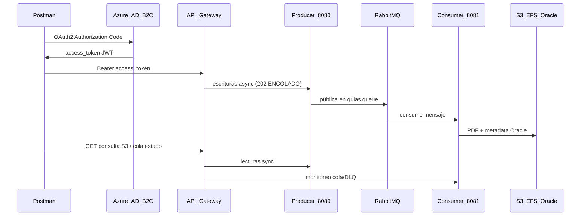

# Guia de pruebas Postman — Semana 8

Base URL evaluacion: `https://c60n9nxi6c.execute-api.us-east-1.amazonaws.com/DEV`

Todas las pruebas usan **Access Token** (no ID Token) en header `Authorization: Bearer {access_token}`.

**Coleccion:** `postman/Pruebas-Semana8.postman_collection.json`  
**Environment:** crear `postman/Semana8.postman_environment.json` (local, en `.gitignore`) con las variables de la sección "OAuth 2.0 en Postman" y completar los secretos desde Azure. Nombre en Postman: **Semana 8**  
**Guía rápida de flujo:** [PRUEBAS_FLOW.md](docs/PRUEBAS_FLOW.md)  
**API Gateway OAS:** `docs/api-gateway-OAS-DEV-proxy-only.json` (JWT Auth + proxy EC2 :8080 producer + :8081 consumer)  
**Setup AWS (Import Merge):** `docs/AWS_GATEWAY_SETUP.md`  
**Despliegue EC2:** [DEPLOY_S8.md](DEPLOY_S8.md)

---

## Arquitectura esperada (Semana 8)



**Escrituras async:** `generar-guia`, subir, actualizar, mover y eliminar guías retornan **202 Accepted** con `estado: ENCOLADO`. Tras unos segundos, verificar con `GET /s3/.../consulta` o **Carpeta 2** (cola/DLQ en consumer :8081).

**Nota del profesor:** usar **Access Token** para llamar APIs. El **ID Token** es para identidad del usuario en frontend, no para autorizar backend. **Client Credentials** es backend-a-backend sin usuario; en Semana 8 se usa login de usuario porque necesitas `extension_UserRole`.

**API Gateway no llama a Azure en cada request** — valida el JWT localmente (iss, aud, firma).

---

## Issuer: un único valor en forma `tfp` (verificado en 0.0 C)

B2C emite el `iss` del Access Token en forma **tfp** con la política en **minúscula** (`b2c_1_cdy2204-1`). Ese **mismo** valor debe estar idéntico en los tres lugares:

| Uso | Valor |
|-----|-------|
| **Token JWT** claim `iss` (0.0 C) | `https://empresatransportistaefs.b2clogin.com/tfp/972f25cf-cd03-4c70-84ea-285778b48398/b2c_1_cdy2204-1/v2.0/` |
| **API Gateway** Authorizer (`b2c_issuer_gateway`) | igual |
| **Spring** `issuer-uri` (`b2c_issuer_canonical`) | igual |

Importante: el match es **case-sensitive**. Azure emite `b2c_1` en minúscula; el Authorizer AWS y el `issuer-uri` de Spring deben usar la misma capitalización.

Audience Gateway: `b2c_audience` (client_id) **o** `b2c_audience_scope` (scope API)

---

## Contraste rutas: Gateway OAS vs Spring Boot

| Metodo | Spring Boot | En Gateway export | Postman | Estado |
|--------|-------------|-------------------|---------|--------|
| GET/POST | `/api/pedidos` | Si | Si | OK |
| GET | `/api/pedidos/{id}` | Si | Si | OK |
| PUT | `/api/pedidos/{id}` | **No** | Si | Agregar en AWS |
| DELETE | `/api/pedidos/{id}` | Si | Si | OK |
| POST | `/api/pedidos/{id}/generar-guia` | Si | Si | OK |
| GET | `/s3/{bucket}/objects` | Si | Si | Corregir URI `{bucket}` |
| GET | `/s3/{bucket}/consulta` | Si | Si | OK |
| GET | `/s3/{bucket}/object` | Si | Si | OK (LECTOR+GESTOR) |
| POST/PUT/DELETE | `/s3/{bucket}/object` | Si | Si | OK |
| POST | `/s3/{bucket}/move` | **No** | Si | Agregar en AWS |

---

## EC2 vs API Gateway — que URL usar

| Request | URL | Cuando usar |
|---------|-----|-------------|
| **0.1** Login GESTOR | `{{api_gateway_url}}/api/pedidos` | OAuth + primera prueba via **Gateway** (evaluacion) |
| **0.0 B** diagnostico | `{{api_gateway_url}}/api/pedidos` | Confirmar JWT Authorizer AWS |
| **0.0 A** diagnostico | `http://{{ec2_host}}:8080/api/pedidos` | Solo debug Spring directo |
| **Carpeta 1** | `{{api_gateway_url}}/...` | Flujo completo evaluacion |
| **0.2** Login LECTOR | `{{api_gateway_url}}/api/pedidos` | OAuth + JWT; **403** esperado (sin S3). PDF en **Carpeta 2** |
| **Carpeta 4** | EC2 directo | No usar en evaluacion |

**Importante:** OAuth obtiene el token de **Azure B2C**, no de EC2 ni Gateway. Sin **Use Token** en Authorization, ambos endpoints dan Unauthorized.

**Nota Postman:** el script de **0.1/0.2** ya no bloquea antes de Send — Postman agrega el Bearer OAuth *después* del pre-request. Si falla, el test indicará si faltó Use Token.

**Error `access_token_gestor vacio` en 0.0:** significa que no ejecutaste **0.1** con **Use Token → Send** antes. El pre-request de 0.1 guarda el token en el environment al hacer Send (aunque la respuesta sea 401). Luego ejecuta 0.0 C → 0.0 B → 0.0 A.

### Postman: dropdown de tokens confuso

No busques un token llamado **"user token"** — no existe. Postman muestra tokens guardados con nombres genéricos (**Token Name**) o viejos (**token-gestor**).

| Paso | Qué hacer |
|------|-----------|
| 1 | Abre request **0.1** (no 0.0) |
| 2 | Authorization → **OAuth 2.0** (no "Current Token" ni Bearer manual) |
| 3 | **Get New Access Token** → login Azure GESTOR |
| 4 | En popup: pestaña **Access Token** (profesor: NO ID Token) |
| 5 | **Use Token** → **Use Token Type = Access Token** |
| 6 | **Send** en 0.1 |
| 7 | Environment **Semana 8** → variable `access_token_gestor` debe tener JWT |

Si `token-gestor` no funciona: **Manage Tokens** → eliminar tokens viejos → repetir desde paso 3. Tras reimportar la colección el nombre nuevo es **gestor-access-token**.

---

## Use Token Type = Access Token (obligatorio)

Según el profesor (`palabras_del_profesor_semana_6.txt`):

- **Access Token** → autoriza llamadas al API Gateway y Spring Boot.
- **ID Token** → identifica al usuario en el frontend; usarlo contra el backend es **mala práctica**.

Azure B2C devuelve **ambos** tokens. Postman muestra el dropdown **Use Token Type** cuando existe `id_token` en la respuesta OAuth. Debes seleccionar **Access Token**, no ID Token.

| Señal en JWT (request **0.0 C**) | Access Token (correcto) | ID Token (incorrecto) |
|----------------------------------|-------------------------|------------------------|
| Uso | Llamar APIs | Identidad del usuario |
| `token_use` | ausente o distinto de `id` | suele ser `id` |
| `aud` | client_id **y/o** scope API (`b2c_audience_scope`) | casi solo `b2c_audience` (client_id) |
| `scp` | puede incluir `cdy2204-1` | ausente |
| `extension_UserRole` | presente | puede estar (no basta para distinguir) |

La colección incluye tests automáticos:

- **0.1** / **0.0 C**: `NO es ID Token — usar Access Token (profesor)`
- **0.0 A** / **0.0 B**: bloquean el envío si `access_token_gestor` parece ID Token

Si falla ese test: en **0.1** → **Use Token Type = Access Token** → **Get New Access Token** → **Use Token** → **Send**.

### Access token grisado en Postman (solo ID Token)

Postman **no bloquea** Access Token por la colección: lo deshabilita cuando **Azure no envió `access_token`** en esa sesión OAuth (solo `id_token`). Pasa igual en **0.1** y **0.2** si el scope o la app B2C no están bien.

| Síntoma | Causa |
|---------|-------|
| Dropdown **Access token** grisado | Respuesta OAuth sin `access_token` |
| Solo **ID token** seleccionable | Postman usa lo único que recibió |

**Pasos:**

1. **Manage Tokens** → borrar `lector-access-token` (y tokens viejos).
2. En Authorization verificar **Scope** = `openid offline_access` + URL scope API (`b2c_scope` del environment).
3. **Get New Access Token** → login **LECTOR** (no reutilizar sesión GESTOR en el navegador).
4. Tras login, en el popup deben aparecer **dos** pestañas: Access Token e ID Token.
5. Si solo hay ID Token → en Azure B2C: App registration → **Expose an API** → scope `cdy2204-1` autorizado en el user flow.

**Workaround:** copiar manualmente el Access Token del popup a la variable `access_token_lector` en environment **Semana 8**.

---

## Azure B2C no devuelve access_token (Access token grisado en 0.1 y 0.2)

**Guía detallada portal Azure:** [docs/GUIA_AZURE.md](docs/GUIA_AZURE.md)

Si **Access token** esta deshabilitado en Postman para GESTOR y LECTOR, la causa es **Azure**, no la coleccion.

Con scope solo `openid` (+ `offline_access`), B2C devuelve **solo id_token**. Para obtener **access_token** debes pedir un **scope de API** que exista y este autorizado en el tenant.

### Comprobar en Postman

1. **Get New Access Token** → login.
2. **Manage Tokens** → abrir el token → revisar si el campo **Access Token** esta vacio.
3. Si vacio → Azure no emitio access_token.

### Checklist Azure Portal (App `49f4ab51-5e0e-4139-9cf4-15f566581b07`)

1. **App registrations** → tu app → **Expose an API**
   - Application ID URI configurado (ej. `https://EmpresaTransportistaEFS.onmicrosoft.com/49f4ab51-5e0e-4139-9cf4-15f566581b07`)
   - Scope **`cdy2204-1`** creado (copiar URL exacta del portal)
2. **API permissions** → Add permission → **My APIs** → scope `cdy2204-1` → **Grant admin consent**
3. **User flows** → `B2C_1_cdy2204-1` → **Applications** → la app debe estar seleccionada
4. **User flows** → **Application claims** → incluir claims en **Access Token** (incl. `extension_UserRole`)

### Scopes a probar en Authorization → Scope (Postman)

Copiar **exactamente** desde Azure. Probar uno por uno (borrar token viejo entre intentos):

| Variable environment | Valor |
|---------------------|-------|
| `b2c_scope` (actual) | openid + offline_access + scope API cdy2204-1 |
| `b2c_scope_default_full` | openid + offline_access + `.default` |
| `b2c_scope_client_id` | openid + offline_access + client_id |

Tras cada cambio: **Manage Tokens** → borrar → **Get New Access Token**. El popup debe mostrar **Access Token** e **ID Token**.

### Cuando funcione

- Dropdown **Use Token Type** habilita **Access token**
- **0.0 C** pasa test `NO es ID Token`
- Token tiene claim `scp` o `aud` con scope API

---

## Orden de ejecucion Postman (video Teams)

1. Seleccionar environment **Semana 8**
2. **0.1** OAuth → Get New Access Token → login GESTOR → **Use Token Type = Access Token** → **Use Token** → Send (Gateway → 200)
3. **0.0 C** → validar iss, aud, rol y test **NO es ID Token**
4. **0.0 B** → API Gateway → 200 (Authorizer OK)
5. **0.0 A** → EC2 directo → 200 (Spring OK, opcional)
6. **Carpeta 1** → flujo GESTOR (escrituras **202 ENCOLADO**)
7. **Carpeta 2** → monitoreo RabbitMQ/DLQ (consumer :8081)
8. Re-ejecutar GET consulta S3 en Carpeta 1.2 tras procesamiento consumer
9. Manage Tokens → borrar tokens; ventana privada → **0.2** OAuth LECTOR → Tests `LECTOR_GUIAS`
10. **Carpeta 3** → GET descarga PDF **200**, POST **403**, DELETE **403**
11. **Carpeta 4** → sin token → **401**

---

## Carpeta 3 — validación LECTOR (checklist)

**Pre-requisitos:** Carpeta 1 ejecutada y consumer procesó guía en S3 · roles asignados en Azure ([GUIA_AZURE.md](docs/GUIA_AZURE.md) §4.7) · **0.2** con token LECTOR.

| # | Request | Status esperado | Significado |
|---|---------|-----------------|-------------|
| 1 | GET descargar guía | **200** | LECTOR puede descargar |
| 2 | POST crear pedido | **403** | LECTOR no puede crear |
| 3 | DELETE eliminar guía | **403** | LECTOR no puede eliminar |

**Si POST/DELETE dan 200:** el token es de GESTOR (mismo usuario que 0.1). Repite **0.2** con `lisbeth.bilbao.merino@gmail.com` y revisa Tests en 0.2 (`extension_UserRole` = `LECTOR_GUIAS`).

---

## Carpeta 2 — monitoreo RabbitMQ (checklist)

| # | Request | Status esperado | Significado |
|---|---------|-----------------|-------------|
| 1 | GET estado cola | **200** | Mensajes en `guias.queue` |
| 2 | GET estado DLQ | **200** | Mensajes en `guias.dlq` |
| 3 | POST generar con `X-Simular-Error: true` | **202** | Error encolado → DLQ |
| 4 | GET mensajes DLQ | **200** | Evidencia mensaje fallido |

Mostrar RabbitMQ Management UI (`:15672`) en el video si es posible.

---

## Diagnostico 404 LECTOR (guia no existe en S3)

Si **Carpeta 2 → GET descargar guia** devuelve:

```json
{
  "status": 404,
  "error": "Object Not Found",
  "message": "El objeto '20250604/TransportesSur/guia-PED-001.pdf' no existe en el bucket 'cdy2204-1'"
}
```

**No es fallo de UserRole.** Spring ya acepto el token LECTOR. Falta el PDF en S3.

| Codigo | Causa | Accion |
|--------|-------|--------|
| **401** / `Unauthorized` | Token invalido o Gateway | OAuth / Authorizer |
| **403** | Rol incorrecto | Token GESTOR en Carpeta 2 POST/DELETE |
| **404** Object Not Found | Archivo no esta en S3 o `nombreGuia` desincronizada | Carpeta 1 pasos 1-2; reimportar coleccion (sync desde `s3_key_pedido_1`) |

### 404 por nombreGuia desincronizado (Cloud 6-7)

Si el mensaje cita `...-actualizado-actualizado.pdf` y ese archivo no esta en S3: los pasos **6. PUT** y **7. Mover objeto** mutaron/movieron la guia. La coleccion actualizada sincroniza Carpeta 2 GET desde `s3_key_pedido_1`. Workaround: `nombreGuia` = PDF que existe en bucket o regenerar guia (paso 2).

### Por que 0.1 GESTOR puede dar 200 y Carpeta 2 GET da 404

| Request | Endpoint | Necesita PDF en S3 |
|---------|----------|-------------------|
| **0.1** GESTOR | `GET /api/pedidos` | **No** |
| **0.2** LECTOR | `GET /api/pedidos` vía Gateway → **403** | **No** |
| **Carpeta 2 GET** | `GET /s3/.../object` | **Si** |

### Orden minimo antes de Carpeta 2

1. **0.1** → login `lisbethbilbao1@gmail.com` → Tests: `GESTOR_GUIAS`
2. **Carpeta 1** → `1. POST Crear pedido 1` → **201**
3. **Carpeta 1** → `2. POST Generar guia pedido 1` → **202 ENCOLADO** (consumer procesa; luego GET consulta S3)
4. (Opcional) **Carpeta 1** → `3. GET Consulta` o `4. GET Descargar guia` → **200**
5. Ventana privada → **0.2** → login `lisbeth.bilbao.merino@gmail.com` → Tests: `LECTOR_GUIAS`
6. **Carpeta 2 GET** → **200** PDF

### Verificar guia en S3 (GESTOR, tras Carpeta 1)

```
GET {{api_gateway_url}}/s3/{{bucket}}/consulta?fecha=20250604&transportista=TransportesSur
```

Debe listar al menos 1 guia. Variable environment esperada: `s3_key_pedido_1` = `20250604/TransportesSur/guia-PED-001.pdf`.

### Validacion UserRole en Tests (0.1 y 0.2)

| Request | Usuario | Test automatico en pestaña **Tests** |
|---------|---------|--------------------------------------|
| **0.1** | `lisbethbilbao1@gmail.com` | `Access Token con extension_UserRole GESTOR` |
| **0.2** | `lisbeth.bilbao.merino@gmail.com` | `Access Token LECTOR_GUIAS` |

Si el test de rol pasa en verde en **0.2** pero **Carpeta 2 GET** da **404**, el rol esta OK — falta ejecutar Carpeta 1.

---

## Diagnostico Unauthorized

| Respuesta | Origen | Accion |
|-----------|--------|--------|
| `{"message":"Unauthorized"}` | API Gateway JWT Authorizer | **Issuer/aud del token ≠ AWS.** Actualizar Authorizer: iss = forma `tfp` con `b2c_1` minúscula (ver 0.0 C). Re-import OAS o editar consola. |
| `WWW-Authenticate: Bearer ... decode the Jwt` (body vacío) | Spring Boot (EC2) | `issuer-uri`/`jwk-set-uri` en `application.properties` ≠ token. Corregir a `tfp` y redeployar imagen. |
| 401 con body Spring (timestamp, status) | Spring Boot | Token invalido para issuer Spring |
| 403 Forbidden | Spring Security | Token OK pero rol incorrecto (LECTOR en endpoint GESTOR) |

---

## OAuth 2.0 en Postman

| Variable | Valor |
|----------|-------|
| Auth URL | `b2c_auth_url` |
| Token URL | `b2c_token_url` |
| Client ID | `b2c_client_id` |
| Scope | API scope + openid (no solo openid) |
| Redirect URI | `https://oauth.pstmn.io/v1/callback` |

Grant: **Authorization Code with PKCE** (requests **0.1** y **0.2**).

---

## Roles Azure AD B2C

| Claim | Rol | Acceso |
|-------|-----|--------|
| `extension_UserRole=GESTOR_GUIAS` | Gestor (`lisbethbilbao1@gmail.com` — **0.1**) | Todos los endpoints |
| `extension_UserRole=LECTOR_GUIAS` | Lector (`lisbeth.bilbao.merino@gmail.com` — **0.2**) | Solo `GET /s3/{bucket}/object` |

---

## Referencia endpoints via Gateway

```
GET/POST  {{api_gateway_url}}/api/pedidos
GET/PUT/DELETE  {{api_gateway_url}}/api/pedidos/{id}
POST  {{api_gateway_url}}/api/pedidos/{id}/generar-guia
GET  {{api_gateway_url}}/s3/{{bucket}}/objects
GET  {{api_gateway_url}}/s3/{{bucket}}/consulta?fecha=&transportista=
GET  {{api_gateway_url}}/s3/{{bucket}}/object?fecha=&transportista=&nombreGuia=
POST/PUT  {{api_gateway_url}}/s3/{{bucket}}/object
POST  {{api_gateway_url}}/s3/{{bucket}}/move?sourceKey=&destKey=
DELETE  {{api_gateway_url}}/s3/{{bucket}}/object?fecha=&transportista=&nombreGuia=

# Consumer (:8081) — monitoreo RabbitMQ
GET  {{api_gateway_url}}/api/cola/estado
GET  {{api_gateway_url}}/api/cola/dlq/estado
GET  {{api_gateway_url}}/api/dlq/mensajes?limite=10
POST {{api_gateway_url}}/api/cola/procesar-uno
```

---

## Checklist pre-demo

- [ ] Environment **Semana 8** activo
- [ ] **0.1** Tests verde: `extension_UserRole` = **GESTOR_GUIAS**
- [ ] **Carpeta 1** requests 1 (**201**) + 2 (**202 ENCOLADO**)
- [ ] **Carpeta 2** monitoreo cola/DLQ (consumer)
- [ ] **Use Token Type = Access Token** en 0.1 y 0.2 (no ID Token)
- [ ] **0.2** Tests verde: `LECTOR_GUIAS` + **403** en Gateway (no requiere PDF)
- [ ] **Carpeta 3** GET **200** PDF (no 404), POST **403**, DELETE **403**
- [ ] **0.0 B** Gateway 200
