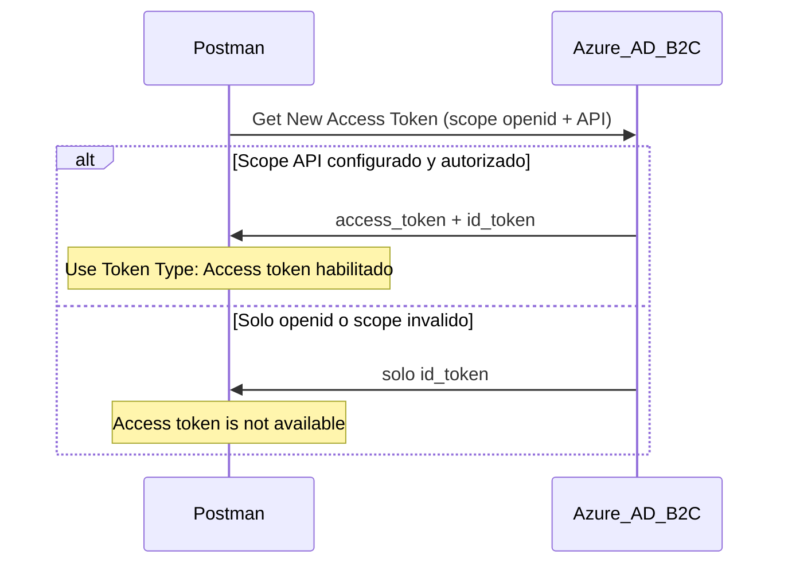
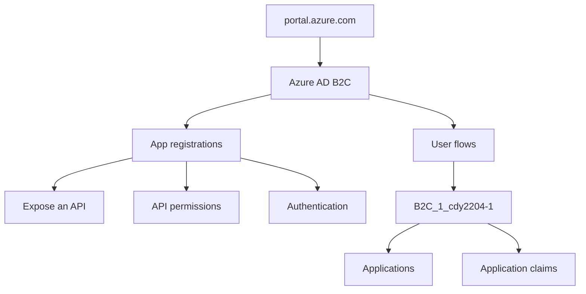

# Guía Azure AD B2C — Access Token en Postman (Semana 8)

Esta guía explica **dónde revisar y qué configurar en el portal Azure** cuando Postman muestra **"Access token is not available"** (solo puedes usar ID Token).

**Relacionado:** [POSTMAN_PRUEBAS.md](../POSTMAN_PRUEBAS.md) · [AWS_GATEWAY_SETUP.md](AWS_GATEWAY_SETUP.md)

---

## 1. Contexto: por qué Postman no muestra Access Token

El profesor indica usar **Access Token** para llamar APIs (Gateway, Spring Boot), no **ID Token** (identidad del usuario en frontend).

| Síntoma en Postman | Causa |
|--------------------|-------|
| **Access token is not available** (grisado) | Azure no devolvió `access_token` |
| Solo **ID token** seleccionable | Respuesta OAuth con `id_token` únicamente |
| **Manage Tokens** → Access Token vacío | Misma causa: configuración B2C o scope incorrecto |

Postman **no bloquea** el Access Token: refleja lo que Azure emitió.

---

## 2. Datos de referencia del proyecto

Usa estos valores al navegar el portal. **No pegues secretos** en documentos ni en Git.

| Campo | Valor |
|-------|-------|
| Portal | [https://portal.azure.com](https://portal.azure.com) |
| Servicio | **Azure AD B2C** (Microsoft Entra External ID) |
| Tenant (nombre) | `empresatransportistaefs` / `EmpresaTransportistaEFS` |
| Tenant ID | `972f25cf-cd03-4c70-84ea-285778b48398` |
| Client ID (app) | `49f4ab51-5e0e-4139-9cf4-15f566581b07` |
| User flow | `B2C_1_cdy2204-1` |
| Scope API (nombre) | `cdy2204-1` |
| Scope URL completa | `https://EmpresaTransportistaEFS.onmicrosoft.com/49f4ab51-5e0e-4139-9cf4-15f566581b07/cdy2204-1` |
| Redirect URI Postman | `https://oauth.pstmn.io/v1/callback` |
| Claim de rol | `extension_UserRole` |
| Roles | `GESTOR_GUIAS` · `LECTOR_GUIAS` |
| OpenID config | `https://EmpresaTransportistaEFS.b2clogin.com/EmpresaTransportistaEFS.onmicrosoft.com/B2C_1_cdy2204-1/v2.0/.well-known/openid-configuration` |

Variables equivalentes en Postman: environment **Semana 8** (`postman/Semana8.postman_environment.json`).

---

## 3. Cómo entrar al portal

1. Abre [https://portal.azure.com](https://portal.azure.com) e inicia sesión.
2. Busca en la barra superior: **Azure AD B2C** (o **Microsoft Entra External ID**).
3. Arriba verifica el **directorio/tenant** correcto (`empresatransportistaefs`).

---

## 4. Paso a paso en Azure Portal

### 4.1 Exponer la API (Expose an API)

**Menú:** Azure AD B2C → **App registrations** (Registros de aplicaciones) → selecciona la app con Client ID `49f4ab51-5e0e-4139-9cf4-15f566581b07` → **Expose an API** (Exponer una API).

**Qué verificar:**

| Elemento | Acción |
|----------|--------|
| **Application ID URI** | Debe estar configurado. Ejemplo: `https://EmpresaTransportistaEFS.onmicrosoft.com/49f4ab51-5e0e-4139-9cf4-15f566581b07` |
| **Scopes defined by this API** | Debe existir el scope **`cdy2204-1`** |
| **Scope full URL** | Copia la URL **exacta** que muestra Azure (debe coincidir con `b2c_audience_scope` en Postman) |

**Si falta el scope:**

1. **Add a scope**
2. Scope name: `cdy2204-1`
3. Admin consent display name / description: texto descriptivo (ej. "Acceso API transportista")
4. **Save**

Sin scope expuesto, Azure **no puede** emitir `access_token` para la API.

---

### 4.2 Permisos de API (API permissions)

**Menú:** misma app → **API permissions** (Permisos de API).

**Qué hacer:**

1. **Add a permission** (Agregar permiso)
2. Pestaña **APIs my organization uses** / **Mis API**
3. Selecciona **tu aplicación** (la misma app o la API registrada)
4. Marca el scope **`cdy2204-1`**
5. **Add permissions**
6. Clic en **Grant admin consent for [tenant]** (Conceder consentimiento de administrador)
7. Estado debe quedar **Granted** (con check verde)

Sin consentimiento admin, el scope puede no incluirse en el token.

---

### 4.3 Autenticación y redirect URI (Authentication)

**Menú:** misma app → **Authentication** (Autenticación).

**Qué verificar:**

| Elemento | Valor / acción |
|----------|----------------|
| **Platform** | Web (o configuración que permita Authorization Code) |
| **Redirect URI** | `https://oauth.pstmn.io/v1/callback` (Postman OAuth) |
| **Implicit grant** | No usar solo implicit; Semana 8 usa **Authorization Code + PKCE** |
| **Allow public client flows** | Según tu configuración B2C (Postman actúa como cliente público con PKCE) |

Si falta el redirect URI, **Get New Access Token** en Postman fallará antes de devolver tokens.

---

### 4.4 User flow — aplicación vinculada

**Menú:** Azure AD B2C → **User flows** (Flujos de usuario) → **`B2C_1_cdy2204-1`**.

**Pestaña Applications (Aplicaciones):**

1. **Add application**
2. Selecciona la app `49f4ab51-5e0e-4139-9cf4-15f566581b07`
3. Confirma que aparece en la lista del user flow

Si la app no está en el user flow, el login OAuth de Postman no obtiene tokens con los scopes correctos.

---

### 4.5 User flow — claims en Access Token

**Menú:** mismo user flow `B2C_1_cdy2204-1` → **Application claims** (Notificaciones de aplicación / Application claims).

**Qué verificar:**

| Token | Claims necesarios |
|-------|-------------------|
| **ID Token** | `extension_UserRole` (y claims de usuario que uses) |
| **Access Token** | **`extension_UserRole`** (crítico para Spring Security) |

Marca los claims para **Access Token**, no solo para ID Token. Spring valida el **Access Token** en el header `Authorization: Bearer ...`.

Opcional (compatibilidad con API Gateway AWS): en el user flow, revisa **Token compatibility settings** → emisión de issuer compatible con OIDC, si tu tenant lo ofrece. Ver [AWS_GATEWAY_SETUP.md](AWS_GATEWAY_SETUP.md).

---

### 4.6 Certificados y secretos (Client secret)

**Menú:** App registrations → tu app → **Certificates & secrets** (Certificados y secretos).

- El **Client secret** se usa en Postman (variable `b2c_client_secret` en environment **Semana 8**).
- **No copies el secret en esta guía ni en GitHub.**
- Si expira, crea uno nuevo y actualiza el environment Postman.

---

### 4.7 Usuarios GESTOR y LECTOR (dos cuentas distintas)

La actividad exige **2 roles**. En B2C cada usuario lleva **un solo** valor en `extension_UserRole`. Para Postman y la presentación necesitas **dos usuarios**, no reutilizar el mismo email en 0.1 y 0.2.

**Asignación recomendada (proyecto Semana 8):**

| Usuario (email) | Postman | `extension_UserRole` | Carpetas |
|-----------------|---------|----------------------|----------|
| `lisbethbilbao1@gmail.com` | **0.1** GESTOR | `GESTOR_GUIAS` | 1 |
| `lisbeth.bilbao.merino@gmail.com` | **0.2** LECTOR | `LECTOR_GUIAS` | 2 |

#### Paso A — Verificar atributo personalizado

**Menú:** Azure AD B2C → **User attributes** (Atributos de usuario).

| Elemento | Valor esperado |
|----------|----------------|
| Nombre | `UserRole` (en tokens aparece como `extension_UserRole`) |
| Tipo | String |

Si no existe, créalo antes de asignar roles a usuarios.

#### Paso B — Incluir el rol en el Access Token

**Menú:** Azure AD B2C → **User flows** → `B2C_1_cdy2204-1` → **Application claims** (Notificaciones de aplicación).

Marca **UserRole** (o `extension_UserRole`) para **Access Token** e **ID Token**.

#### Paso C — Asignar rol a cada usuario

**Menú:** Azure AD B2C → **Users** (Usuarios) → selecciona el usuario → **Edit** (Editar) o **Properties**.

1. Usuario **`lisbethbilbao1@gmail.com`**
   - Display name: ej. `Gestor Guias`
   - Atributo **UserRole** / `extension_UserRole`: **`GESTOR_GUIAS`**
   - **Save**

2. Usuario **`lisbeth.bilbao.merino@gmail.com`**
   - Display name: ej. `Lector Guias`
   - Atributo **UserRole** / `extension_UserRole`: **`LECTOR_GUIAS`**
   - **Save**

Si el campo no aparece al editar el usuario, vuelve al user flow → **User attributes** y asegúrate de que el atributo esté seleccionado en el flujo.

**Asignar valores con Graph API:** ver [UPDATE_USERS.md](UPDATE_USERS.md) (PATCH `extension_UserRole` cuando el portal no muestra el campo).

#### Paso D — Comprobar en Postman

| Request | Claim esperado en **0.0 C** |
|---------|----------------------------|
| Tras **0.1** (login gestor) | `extension_UserRole` = `GESTOR_GUIAS` |
| Tras **0.2** (login lector) | `extension_UserRole` = `LECTOR_GUIAS` |

Para **0.2**, cierra sesión B2C en el navegador o usa ventana privada para no reutilizar la sesión del GESTOR.

**Error frecuente:** usar el mismo email en 0.1 y 0.2. La descarga (GET object) da **200** con ambos roles; la demo falla en Carpeta 2 (POST/DELETE deben dar **403** solo con token LECTOR).

---

## 5. Verificación en Azure (sin Postman)

1. Abre en el navegador la URL OpenID Configuration:

   `https://EmpresaTransportistaEFS.b2clogin.com/EmpresaTransportistaEFS.onmicrosoft.com/B2C_1_cdy2204-1/v2.0/.well-known/openid-configuration`

2. Confirma que el JSON incluye:
   - `issuer`
   - `jwks_uri`
   - `authorization_endpoint` / `token_endpoint`

3. En **Expose an API**, confirma que la URL del scope `cdy2204-1` coincide **carácter por carácter** con el Scope en Postman.

---

## 6. Verificación en Postman (después de Azure)

### 6.1 Limpiar tokens viejos

1. Request **0.1** o **0.2** → Authorization
2. Dropdown **Token** → **Manage Tokens**
3. Elimina `gestor-access-token` y `lector-access-token`

### 6.2 Obtener token nuevo

1. Environment **Semana 8** activo
2. **0.1 Login GESTOR** → Authorization → OAuth 2.0
3. Campo **Scope**: usa `{{b2c_scope}}` o pega el valor del environment
4. **Get New Access Token** → login GESTOR
5. En el popup deben aparecer **Access Token** e **ID Token**
6. **Use Token** → **Use Token Type = Access token** (ya no grisado)
7. **Send**

### 6.3 Checklist de éxito

- [ ] **Manage Tokens** muestra Access Token con JWT (`eyJ...`)
- [ ] **Use Token Type** permite **Access token**
- [ ] **0.0 C** pasa test `NO es ID Token — usar Access Token (profesor)`
- [ ] Token incluye `extension_UserRole` = `GESTOR_GUIAS` o `LECTOR_GUIAS`

---

## 7. Scopes alternativos en Postman

Si tras configurar Azure sigue sin aparecer Access Token, prueba **uno por uno** en Authorization → Scope (borra token viejo entre intentos):

| Variable environment | Contenido | Cuándo probar |
|---------------------|-----------|---------------|
| `b2c_scope` | openid + offline_access + scope `cdy2204-1` | **Primero** (recomendado) |
| `b2c_scope_default_full` | openid + offline_access + `.default` | Si `b2c_scope` falla |
| `b2c_scope_client_id` | openid + offline_access + client_id | Último recurso B2C |

Valores en `postman/Semana8.postman_environment.json`.

---

## 8. Errores frecuentes

| Error | Origen | Dónde revisar |
|-------|--------|---------------|
| **Access token is not available** | Azure no emitió `access_token` | Secciones 4.1–4.5 de esta guía |
| **Unauthorized** `{"message":"Unauthorized"}` | API Gateway JWT Authorizer | [AWS_GATEWAY_SETUP.md](AWS_GATEWAY_SETUP.md) |
| 401 body Spring (`timestamp`, `status`) | Token inválido para Spring | `application.properties` issuer/aud |
| 403 **Access Denied** + "permisos IAM" | S3 en EC2 | IAM role EC2, no Azure |
| 403 rol LECTOR en POST/DELETE | Spring Security (esperado) | Carpeta 2 — LECTOR solo GET object |

---

## 9. Valores Postman alineados con Azure

Tras confirmar scope en Azure, verifica que el environment **Semana 8** tenga:

| Variable | Uso |
|----------|-----|
| `b2c_auth_url` | Authorization URL (user flow) |
| `b2c_token_url` | Token URL (user flow) |
| `b2c_client_id` | Client ID |
| `b2c_client_secret` | Secret (solo environment, no Git) |
| `b2c_scope` | Scope OAuth completo |
| `b2c_redirect_uri` | `https://oauth.pstmn.io/v1/callback` |
| `b2c_issuer_canonical` | Issuer en claim `iss` del JWT |
| `access_token_gestor` | Se llena tras 0.1 Send |
| `access_token_lector` | Se llena tras 0.2 Send |

Spring Boot valida issuer y audience en `src/main/resources/application.properties`.

---

## 10. Enlaces relacionados

- [POSTMAN_PRUEBAS.md](../POSTMAN_PRUEBAS.md) — flujo Postman Semana 8
- [AWS_GATEWAY_SETUP.md](AWS_GATEWAY_SETUP.md) — API Gateway y JWT Authorizer
- [api-gateway-OAS-DEV-proxy-only.json](api-gateway-OAS-DEV-proxy-only.json) — OAS principal (JWT `azureidaas` + proxy EC2)
- [Semana6.postman_environment.json](../postman/Semana8.postman_environment.json) — variables OAuth
- [Pruebas-Semana8.postman_collection.json](../postman/Pruebas-Semana8.postman_collection.json) — requests 0.1, 0.2, 0.0 C

---

## Resumen en 5 pasos

1. **Expose an API** → scope `cdy2204-1` creado
2. **API permissions** → scope autorizado + **Grant admin consent**
3. **User flow** `B2C_1_cdy2204-1` → app seleccionada + claims en **Access Token**
4. **Authentication** → redirect Postman configurado
5. Postman → borrar tokens viejos → **Get New Access Token** → **Access token** habilitado
